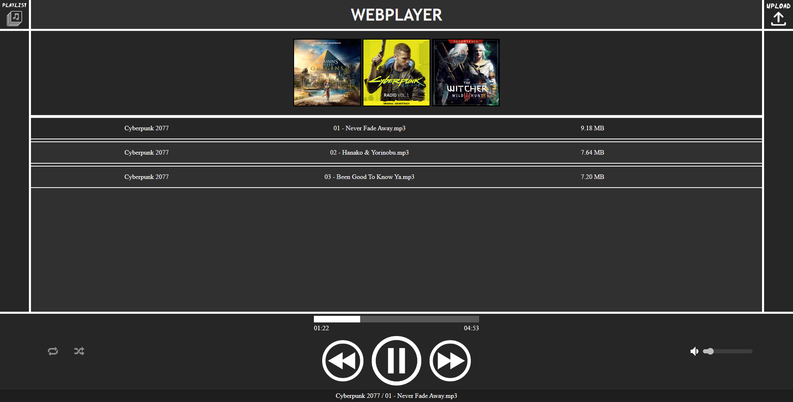

# Music-Player
Simple browser music player - school project

##  Overall info

A simple player to play songs provided by the server.

## Installation

 - Clone/download the repository
 - In `\Server`:
    - In terminal run `npm i` to install dependencies
    - In terminal run `node server.js` to run server (deafult on port 3000)
 - In `\Client`:
    - In terminal run `npm i` to install dependencies
    - In terminal run `npm run build` to build project
    - Run `\dist\index.html`
    

## Features

- Music listening
- Creating playlists
- Looping/shuffle playback/volume change
- Upload of new albums by server (default `localhost:3000/admin`)

